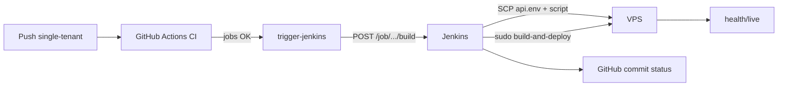

# Parte F.1 — Jenkins CD pós-CI (VPS)

Para um **roteiro completo** de deploy (Jenkins, VPS, Docker Compose, checklist e troubleshooting), use o [Guia de deploy](../../deploy/guia-deploy.md).

## Objetivo

Entregar **deploy contínuo na VPS** com estas regras:

1. **CI no GitHub Actions** (workflow `CI` em [`.github/workflows/ci.yml`](../../.github/workflows/ci.yml)) executa testes e validações; ao concluir com sucesso um **push** na branch `single-tenant`, o job **`trigger-jenkins`** chama o Jenkins (build token + API token).
2. **Jenkins** faz checkout leve (para `GIT_COMMIT` / `GITHUB_REPOSITORY`), grava **`/etc/apptorcedor/api.env`** na VPS a partir do **Jenkins Credentials** e executa na VPS **`build-and-deploy.sh`** (git pull + build).
3. **Segredos de runtime da API** ficam no **Jenkins** (não em `.env` manual na VPS); o arquivo `api.env` no servidor é **gerado a cada deploy**.
4. Após deploy bem-sucedido ou falha, Jenkins envia **commit status** ao GitHub (`context`: `jenkins/cd-vps`) usando PAT com escopo `repo:status`.

## Componentes no repositório

| Caminho | Função |
|---------|--------|
| [`.github/workflows/ci.yml`](../../.github/workflows/ci.yml) | CI + job `trigger-jenkins` (somente push `single-tenant`) |
| [`Jenkinsfile`](../../Jenkinsfile) | Pipeline: checkout → deploy na VPS (api.env + `build-and-deploy.sh`) → status no GitHub |
| [`deploy/vps/build-and-deploy.sh`](../../deploy/vps/build-and-deploy.sh) | Na VPS: `git pull`, `dotnet publish`, `npm ci` / `npm run build`, copia SPA para `wwwroot`, symlink `current`, `systemctl restart`, health check e rollback |
| [`deploy/vps/deploy.sh`](../../deploy/vps/deploy.sh) | Deploy por tarball (fluxo legado / referência); ainda válido para cenários manuais |
| [`deploy/vps/api.env.example`](../../deploy/vps/api.env.example) | Referência de chaves; no fluxo Jenkins o conteúdo real é gerado automaticamente |
| [`deploy/vps/apptorcedor-api.service.example`](../../deploy/vps/apptorcedor-api.service.example) | Exemplo de unidade systemd |
| [`deploy/ci/wait_github_ci.py`](../../deploy/ci/wait_github_ci.py) | Utilitário de **polling** da API de Actions (não usado mais no `Jenkinsfile` padrão; mantido para diagnóstico ou jobs antigos) |

## Docker local (API + SPA)

Imagens por serviço: [`backend/Dockerfile`](../../backend/Dockerfile) e [`frontend/Dockerfile`](../../frontend/Dockerfile). O [`docker-compose.yml`](../../docker-compose.yml) sobe **api** e **web**; o SQL Server fica em **outro servidor** (connection string via `.env`, por exemplo `DATABASE_CONNECTION_STRING`). Variáveis de exemplo: [`.env.compose.example`](../../.env.compose.example). Detalhes no [`README.md`](../../README.md).

## Fluxo

## Secrets no GitHub (repositório)

Configurar em **Settings → Secrets and variables → Actions** (valores reais não entram no repositório):

| Secret | Descrição |
|--------|-----------|
| `JENKINS_URL` | URL base do Jenkins (ex.: `https://jenkins.exemplo.com`, sem barra final) |
| `JENKINS_JOB_NAME` | Nome do job (path URL-encoded se for pasta/job, ex.: `folder%2Fapptorcedor-cd`) |
| `JENKINS_BUILD_TOKEN` | Token configurado em “Trigger builds remotely” no job |
| `JENKINS_USER` | Usuário Jenkins para autenticação HTTP |
| `JENKINS_API_TOKEN` | API token desse usuário |

## Credenciais Jenkins (IDs sugeridos)

Ajuste os IDs no [`Jenkinsfile`](../../Jenkinsfile) ou use **folder credentials** com os mesmos nomes.

| ID | Tipo | Uso |
|----|------|-----|
| `api-connection-string` | Secret text | `ConnectionStrings__DefaultConnection` |
| `api-jwt-key` | Secret text | `Jwt__Key` |
| `api-admin-password` | Secret text | `ADMIN_MASTER_INITIAL_PASSWORD` |
| `api-webhook-secret` | Secret text | `Payments__WebhookSecret` / `PAYMENTS_WEBHOOK_SECRET` (callback legacy D.4) |
| `stripe-api-key` | Secret text | `STRIPE_API_KEY` (`sk_…`; vazio se só Mock) |
| `stripe-webhook-secret` | Secret text | `STRIPE_WEBHOOK_SECRET` (`whsec_…`; vazio se só Mock) |
| `payments-provider` | Secret text | `PAYMENTS_PROVIDER` — `Mock` ou `Stripe` |
| `stripe-success-url` | Secret text | `STRIPE_SUCCESS_URL` (HTTPS; vazio se não usar) |
| `stripe-cancel-url` | Secret text | `STRIPE_CANCEL_URL` (HTTPS; vazio se não usar) |
| `api-cors-origin` | Secret text | `Cors__AllowedOrigins__0` |
| `api-aspnetcore-urls` | Secret text | `ASPNETCORE_URLS` (ex.: `http://127.0.0.1:5031`) |
| `vite-public-api-url` | Secret text | `VITE_API_URL` no build do frontend na VPS |
| `github-token-deploy-status` | Secret text | PAT com **`repo:status`** (criar status no commit) |
| `vps-ssh-key` | SSH Username with private key | SSH para a VPS |
| `vps-host` | Secret text | Hostname ou IP da VPS |

### Variáveis de job (não obrigatoriamente secretas)

| Variável | Padrão no `Jenkinsfile` | Descrição |
|----------|-------------------------|-----------|
| `DEPLOY_BRANCH` | `single-tenant` | Branch cujo nome deve coincidir com `BRANCH_NAME` / `GIT_BRANCH` (sem `origin/`) para executar deploy |
| `DEPLOY_ROOT` | `/opt/apptorcedor` | Raiz: `releases/<id>`, symlink `current` |
| `VPS_REPO_DIR` | `/opt/apptorcedor/repo` | Clone git do repositório na VPS (usado pelo `build-and-deploy.sh`) |
| `APP_SERVICE_NAME` | `apptorcedor-api` | Unidade systemd |
| `APP_HEALTHCHECK_URL` | `http://127.0.0.1:5031/health/live` | Liveness após restart |
| `VPS_PORT` | `22` | Porta SSH |

## Preparação da VPS (uma vez)

1. Criar `DEPLOY_ROOT/releases` e permissões adequadas (ex.: `/opt/apptorcedor/releases`).
2. **Clone do repositório** em `VPS_REPO_DIR` (ex.: `/opt/apptorcedor/repo`), com acesso de **pull** (deploy key ou HTTPS com credencial).
3. Instalar **.NET SDK 10** (não só runtime), **Node.js 22+**, **npm**, **git**, **curl**.
4. Instalar unidade systemd a partir de [`deploy/vps/apptorcedor-api.service.example`](../../deploy/vps/apptorcedor-api.service.example); `EnvironmentFile=/etc/apptorcedor/api.env` (o primeiro deploy Jenkins cria o arquivo).
5. O usuário SSH usado pelo Jenkins precisa poder: `sudo mkdir` em `/etc/apptorcedor`, `sudo install` para `api.env`, `sudo bash /tmp/apptorcedor-build-deploy-*.sh`, e o script interno precisa de `sudo` para `systemctl restart` (política `sudoers` semelhante ao fluxo antigo com `deploy.sh`).

**Não** é mais necessário editar manualmente `/etc/apptorcedor/api.env` antes do primeiro deploy (exceto em cenários fora do Jenkins).

## Job Jenkins

1. Pipeline from SCM, branch `single-tenant`, script path **`Jenkinsfile`**.
2. Habilitar **Trigger builds remotely** e definir o mesmo token que está em `JENKINS_BUILD_TOKEN` no GitHub.
3. Associar todas as credenciais listadas acima.

## Testes (CI)

- Sintaxe Bash: `bash -n deploy/vps/build-and-deploy.sh` no job **Deploy/CD tooling** do GitHub Actions.
- Testes do helper de polling: `deploy/ci/test_wait_github_ci.py` (mantidos).

## Troubleshooting

| Sintoma | Verificação |
|---------|-------------|
| `trigger-jenkins` falha no GitHub | Secrets `JENKINS_*` preenchidos; URL do job correta; usuário e API token válidos; token de trigger igual ao do job |
| `git checkout` no Jenkins falha com `unable to unlink old ... Permission denied` | O deploy local anterior provavelmente rodou com `sudo` sobre o `WORKSPACE`. O `Jenkinsfile` deve usar `VPS_REPO_DIR` como clone dedicado no modo `JENKINS_LOCAL_DEPLOY=true`; após corrigir, faça limpeza única do workspace com `sudo chown -R jenkins:jenkins /var/lib/jenkins/workspace/<job>` ou recrie o workspace antes do próximo build. |
| Deploy falha no `git pull` | Permissões do clone em `VPS_REPO_DIR`; rede; branch existe no remoto |
| Build falha na VPS | SDK .NET e Node instalados; `npm ci` com lockfile consistente |
| Health falha | `ASPNETCORE_URLS` vs `APP_HEALTHCHECK_URL`; SQL acessível; JWT com tamanho mínimo |
| Status não aparece no GitHub | PAT sem `repo:status`; repositório em `GITHUB_REPOSITORY` divergente |

## Decisão técnica

**CI no GitHub Actions** valida o código; **CD no Jenkins** assume CI verde porque só é disparado após o workflow concluir. **Build de release** ocorre **na VPS** para não exigir .NET SDK nem Node no agente Jenkins. **Segredos de produção** concentram-se no **Jenkins Credentials** e são materializados em `api.env` no deploy.
